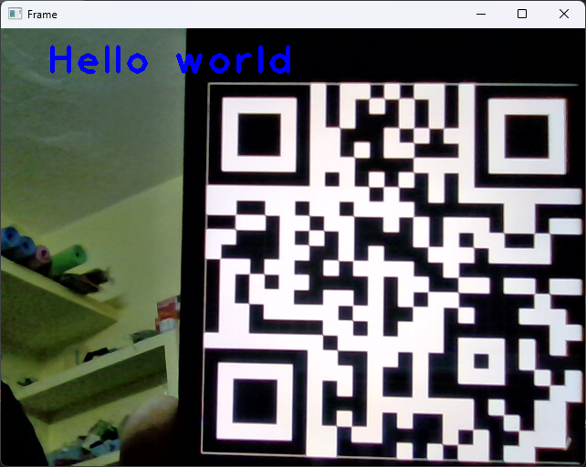

# QR Scanner App

A simple QR Scanner app built with OpenCV and Python. This app allows users to capture video from their webcam, detect QR codes and display the decoded information in real-time.

## Features
- Capture video from the webcam in real-time.
- Detect and decode QR codes using `pyzbar`.
- Display decoded information (QR data) on the screen.
- Flip the video feed horizontally to avoid mirror-image distortion.

## Screenshots

## Technologies Used

- **Python**: The programming language used to develop the app.
- **OpenCV**: Used for video capture, image processing, and manipulation.
- **pyzbar**: A library used to decode QR codes and barcodes.
- **NumPy**: Used for array manipulation and working with image data.

